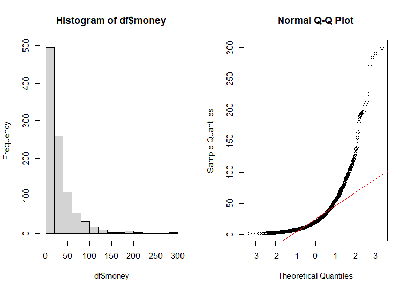
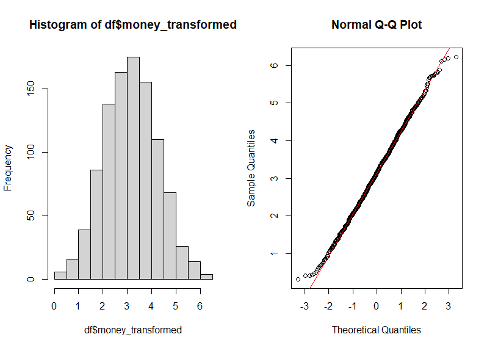

# Box-Cox-transformation
The Box-Cox transformation is a frequently used method in classical statistics. It helps transform non-normal distributions into normal ones. The Box-Cox transformation is particularly beneficial for analyzing financial data in A/B tests, especially when the goal is to detect differences between groups rather than absolute numbers.

Math of Box-Cox:

<code>y^(λ) = (y^λ - 1) / λ, for λ ≠ 0
log(y), for λ = 0</code>

Where <code>y</code> represents the original data and <code>λ</code> is the transformation parameter.

In this simple realization we will transform this distribution

To this

